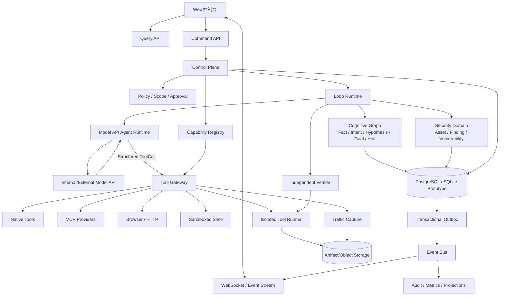
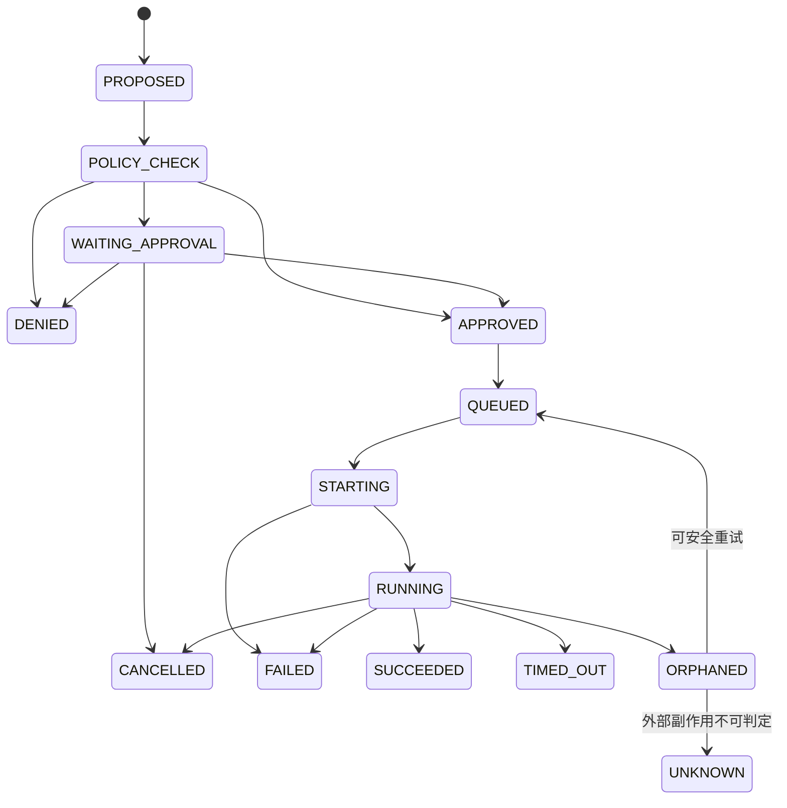

# Cairn 安全 Agent 平台技术执行方案

> 文档状态：架构执行基线（Draft v2）  
> 适用仓库：`C:\kaifa\tool\Cairn`  
> 编制依据：当前 Cairn 源码、`C:\kaifa\tool\图片` 中 30 张产品架构图、黑板模型 TXT 说明，以及《AI渗透测试Agent-从工程实践到Loop Engineering架构思考》PDF。  
> 本文只定义技术演进方案，不代表当前系统已接入真实模型、真实工具或已经完成任何真实漏洞利用。

---

## 1. 执行摘要

图片中的目标系统与 Cairn 的核心思想总体契合，但不属于简单的前后端页面优化。目标实际上是把 Cairn 从“通用 Fact–Intent 状态空间搜索内核”扩展为“具备资产、漏洞、证据、工具、审批、审计和 Loop Engineering Runtime 的安全 Agent 控制平台”。

本方案采取以下总体策略：

1. 保留 Cairn 已有的 Project / Fact / Intent / Hint 图协议，作为认知内核。
2. 不把资产、漏洞、工具、审批、流量等数据继续塞入 `Fact.description`。
3. 在认知内核外新增能力控制面、安全领域层、证据与验证层、事件审计层。
4. Planner、Main Agent、Worker、Verifier 等名称表达“任务能力和权限配置”，不设计成互相直接通信的固定人格流水线。
5. 生产 Agent 统一采用“模型 API + 结构化 Tool Calling”；模型只提出 ToolCall，所有实际执行统一通过 Tool Gateway 和隔离 Runner，Agent 不直接获得 Shell、目标网络或协议写权限。
6. 先建立 Tool、Skill、MCP、Agent Profile 和工具矩阵的数据契约及页面位置，再逐步接入 Provider；不一次性接入全部工具。
7. 项目完成必须经过独立验证，不能继续由提出完成声明的 Agent 自证。
8. 采用兼容式、可回滚迁移，先保持现有 API 和 Mock E2E 流程可用，再逐步启用新能力。
9. 以固定评测集保护当前高命中模式；任何 Planner、Skill、MCP 或 Loop 改造都必须通过同模型、同预算 A/B 质量闸门。
10. 人工干预、执行轨迹和 HTTP(S) 流量均作为可持久化、可关联、可回放的一等数据，不依赖临时聊天或普通文本日志。

### 1.1 目标判断

| 维度 | 当前情况 | 目标判断 |
| --- | --- | --- |
| Fact–Intent 黑板循环 | 已实现 | 保留并增强 |
| 空闲 Worker 调度 | 已实现集中式选择 | 保留，补租约历史和多调度器能力 |
| Agent 角色 | 当前无固定角色 | 以能力 Profile 实现，不做刚性角色工厂 |
| 工具、Skill、MCP | 未实现 | 新增独立能力控制面 |
| 资产、API、参数 | 未实现 | 新增安全领域模型 |
| 漏洞与独立验证 | 未实现 | 新增 Finding / Vulnerability / Verification |
| 审批与命令拦截 | 未实现，且 Worker 适配器存在权限绕过 | 必须先建立 Tool Gateway 和策略引擎 |
| AI 思考可观测性 | 仅结构化最终输出和日志 | 展示决策摘要、工具调用和证据，不保存隐藏思维链 |
| Loop Engineering | 只有 `reason/explore` 基础循环 | 增加 Outer/Middle/Inner/Verify 明确状态 |
| 实时前端 | 定时轮询 | 逐步迁移为事件流/WebSocket |
| 生产并发 | SQLite + 单 Dispatcher | 原型可保留，生产目标迁移 PostgreSQL + 多实例租约 |

### 1.2 最终需求与架构验收映射

| 最终需求 | 主要承载模块 | 结果验收 |
| --- | --- | --- |
| 黑板可视化 Agent 行为、判断和漏洞 | Cognitive Graph + Graph Projection + Execution/Evidence | 可从 Fact/Intent 追溯到 ToolCall、Evidence、Finding 和 Verification；大图支持按层级、类型和时间过滤 |
| AI 按需调用 Tool/Skill/MCP | Model API Agent Runtime + Tool Gateway + Capability Registry | 模型只能产生结构化 ToolCall，无法绕过 Gateway 直接访问目标或启动工具 |
| 风险排序、拦截和审批 | Policy Engine + Risk Evaluator + Approval | 未审批高风险调用不能进入 RUNNING，参数、Scope、Provider 或策略版本变化会使审批失效 |
| AI 自主完成授权扫描 | Outer/Middle/Inner Loop + Budget/Stopping | 在机器可读 Scope 和预算内可自主枚举、转向、验证和停止；危险利用仍受审批约束 |
| 保持当前高命中模式 | Benchmark/Evaluation Gate | 改造版在同模型、同工具、同预算基准上的确认命中率不低于既有基线，且假阳性不升高 |
| 人工干预主 Agent | HumanIntervention + Main Agent Session | Hint、纠错、优先级调整、暂停、取消和恢复均持久化，并能证明被后续 Loop 消费 |
| 每次操作可查看 | Execution/ToolCall/Event/Evidence/Audit | 任意 Finding 可反向追溯到执行者、策略、审批、工具参数摘要、流量和证据 |
| 流量分析 | Project Traffic Proxy + Traffic Pipeline | HTTP(S) 请求/响应可关联 execution_id、tool_call_id、intent_id 和 asset_id，并支持脱敏、检索、差异和异常分析 |
| 覆盖图片中的其余页面 | Screen-to-Contract Traceability Matrix | 每个页面都有权威实体、Query API、Command API、状态机和阶段归属，不允许假运行或前端自造状态 |

---

## 2. 当前系统基线

### 2.1 当前组件

```text
Web UI（Alpine.js + Cytoscape）
        │
FastAPI Server + SQLite
        │
单 Dispatcher
        │
项目容器 / 本地工作目录
        │
Codex / Claude Code / Pi / Mock CLI Worker
```

### 2.2 当前权威数据

当前服务端只有以下核心实体：

- Project：任务状态、标题、Bootstrap 配置、Reason lease。
- Fact：`id + description`。
- Intent：来源 Fact、目标 Fact、描述、创建者、当前 Worker、心跳和完成时间。
- Hint：外部策略提示。

### 2.3 当前调度语义

- Dispatcher 是唯一协议写入者。
- Agent 不直接 claim Intent、不直接 heartbeat、不直接调用 Cairn Server API。
- Dispatcher 向 Agent 下发 `bootstrap`、`reason` 或 `explore` 任务。
- Worker 选择依据任务类型、当前并发、健康状态、拒绝冷却状态和优先级。
- Intent 通过 heartbeat 认领，超时后释放给其他 Worker。
- 当前实现按单 Dispatcher 设计和测试。

### 2.4 当前运行事实

- 当前 Docker 中 `cairn-server` 和 `cairn-dispatcher` 已运行。
- 当前 `dispatch.yaml` 使用 `prompt_group: mock`。
- 当前 Worker 是两个 Mock Agent。
- 当前演示图中的漏洞、资产和攻击链不能视为本实例已经真实发现或利用的结果。

---

## 3. 目标范围与非目标

### 3.1 本轮目标

- 确立目标平台的模块边界。
- 先实现 Tool、Skill、MCP 和工具矩阵的“位置、契约、状态和只读页面”。
- 为后续接入真实 Provider 保留稳定接口。
- 建立资产、证据、漏洞、验证、审批、审计的数据模型演进路线。
- 让图片中的前端页面最终都有明确的数据来源和状态机支撑。
- 逐步实现 PDF 中提出的 Outer / Middle / Inner Loop 与独立 Verify。

### 3.2 明确非目标

- 不在第一阶段接入大量真实安全工具。
- 不在第一阶段启用高风险 Shell 自动执行。
- 不把所有图片页面一次性做完。
- 不保存或展示模型私有隐藏思维链。
- 不把固定 Agent 角色当作唯一调度方式。
- 不在未建立目标授权、审批和审计前执行真实漏洞利用。

---

## 4. 架构原则

### 4.1 图是认知内核，不是全业务数据库

Fact–Intent 图只回答：

- 当前确认了什么？
- 下一步为什么要做？
- 哪些事实支撑这个探索意图？
- 新结论从哪条路径产生？

以下内容必须是独立领域实体：

- Asset / Service / Endpoint / Parameter
- Tool / Skill / MCP Server
- ToolCall / Execution / Artifact
- Finding / Vulnerability / Verification
- Approval / PolicyDecision / AuditEvent
- TrafficRecord

图可以引用这些实体，并在前端投影成复合节点，但不能让 `Fact.description` 成为唯一存储。

### 4.2 角色是能力，不是固定人格

将图片中的角色映射为能力配置：

| 图片名称 | 技术语义 | 是否长期驻留 |
| --- | --- | --- |
| Main Agent | 人机协同入口、控制建议与态势摘要 | 否，按会话或任务实例化 |
| Planner | Outer/Middle Loop 决策能力 | 否，按循环实例化 |
| Worker | Inner Loop 执行能力 | Worker Pool 中按需领取任务 |
| Verifier | 独立证据验证能力 | 按 Finding 触发 |
| Auto | 平台管理与自动化操作 Profile | 不参与默认渗透推理 |
| Pentest Agent | 组合 Profile，可规划、执行和验证 | 用于单 Agent 模式，不替代控制面 |

### 4.3 单一写入控制面

- Agent 只能提交 Proposal、ToolCallRequest、IntentProposal 或 CompletionClaim。
- Dispatcher / Loop Runtime / Policy Engine 负责检查和落库。
- Main Agent 不得绕过 Dispatcher 直接修改 Worker 本地状态。
- 取消任务以 `execution_id` 为目标，通过取消令牌完成；避免使用模糊的 `kill_worker`。

### 4.4 工具矩阵是派生视图

工具矩阵来源于：

```text
Agent Profile
  + AgentToolGrant
  + AgentSkillGrant
  + SkillToolRequirement
  + Tool 当前状态
  + 项目级策略
  + 风险和审批策略
```

前端不硬编码矩阵，也不维护一份与授权表平行的数据副本。

### 4.5 完成声明不可自证

提出完成声明的执行者不能直接把 Project 改为 `completed`。应经历：

```text
CompletionClaim
    → Evidence Audit
    → Independent Verification
    → Goal Evaluator
    → ready=true
    → Project completed
```

### 4.6 生产 Agent 采用模型 API + Tool Calling

本项目正式选择模型 API + Tool Calling 作为生产执行路径：

```text
Graph/Loop Context
    → Model API
    → Assistant Message / Structured ToolCall
    → Tool Gateway
    → Policy / Scope / Risk / Approval
    → Isolated Runner / MCP Provider
    → ToolResult / Evidence
    → Model API 下一轮判断
```

强制边界：

- 模型进程不直接挂载项目执行容器，不持有 Docker Socket，不直接访问目标网络。
- Shell、HTTP、Browser、Native Tool 和 MCP Tool 都作为注册 Tool，经同一 Gateway 执行。
- MCP Server 是不可信 Provider，其 Schema、输出和网络权限均不能绕过 Policy。
- Codex/Claude Code/Pi CLI 只作为 legacy compatibility、开发诊断或离线对照路径；生产模式默认禁用。
- 如保留 Legacy CLI 对照，必须运行在无目标网络、无宿主写权限的隔离环境中，其结果不得直接写入生产项目状态。
- 模型 API Provider 必须支持结构化输出或稳定的 Tool Calling；不满足者只能通过受校验适配器进入，不能退化为让模型自由拼接 Shell。

### 4.7 推理开放、执行受控

- Tool/Skill/MCP 是模型思考后的可选能力，不是固定流水线的起点。
- Outer/Middle Loop 可以自由提出新 Hypothesis、Intent 和工具组合。
- 控制面只限制实际副作用、授权范围、资源预算和审计要求，不用固定角色或固定扫描顺序代替模型判断。
- Skill 采用按需检索和渐进加载，避免把全部能力说明塞入上下文造成工具锚定和命中率下降。

### 4.8 Goal 与 Project 生命周期机器可读

Goal 不再只依赖自然语言特殊 Fact。新增 GoalDefinition，至少包含 `goal_type`、`success_criteria`、`required_evidence_types`、`minimum_confidence`、`coverage_requirement`、`prohibited_side_effects` 和 `verification_policy`；原 `goal` Fact 作为兼容展示和图入口。

引入 CompletionClaim 后，Project 状态演进为：

```text
ACTIVE ↔ PAUSED
ACTIVE → COMPLETION_PENDING → VERIFYING → COMPLETED
                              ↘ ACTIVE（验证失败/继续探索）
ACTIVE/PAUSED/VERIFYING → CANCELLED
```

旧 `/complete` 在 Feature Flag 关闭时维持原行为；新模式下转换为 CompletionClaim。`reopen` 不再物理删除历史完成边，而是追加 `revoked/superseded` 记录和纠错 Fact。

---

## 5. 目标总体架构



### 5.1 逻辑层次

1. **Control Plane**：任务、用户、授权范围、策略、审批、密钥引用、暂停和终止。
2. **Cognitive Graph**：Fact、Intent、Hint、Hypothesis、Goal 及因果关系。
3. **Loop Runtime**：Outer、Middle、Inner、Verify 循环与预算控制。
4. **Security Domain**：资产、端点、参数、Finding、漏洞和验证状态。
5. **Capability Plane**：Tool、Skill、MCP、Agent Profile、授权矩阵。
6. **Execution Plane**：项目容器、进程、工具执行、取消和资源限制。
7. **Evidence Plane**：HTTP 报文、截图、日志、文件、哈希和证据引用。
8. **Event/Audit Plane**：不可抵赖事件、实时 UI、统计、审计与回放。
9. **Agent Runtime**：构造受控模型上下文、调用模型 API、校验 Assistant/ToolCall 输出并驱动下一轮；不直接执行工具。
10. **Traffic Plane**：项目级 HTTP(S) 代理、规范化、脱敏、会话关联、差异分析和 Evidence 生成。

---

## 6. Tool、Skill、MCP 与工具矩阵预留方案

## 6.1 领域定义

### Tool

Tool 是可执行的最小能力单元。示例类型：

- `builtin`：系统内置结构化操作。
- `native`：本地二进制或受控脚本。
- `mcp`：由 MCP Server 暴露。
- `http`：统一 HTTP 客户端。
- `browser`：浏览器自动化能力。
- `query`：只读查询资产、Fact、Finding 等内部数据。

### Skill

Skill 是一组可版本化的指令、流程、约束和工具依赖。Skill 不直接获得无限权限，其实际可调用工具由以下交集决定：

```text
Skill 声明的 required_tools
∩ Agent Profile 的 allowed_tools
∩ Project Policy 的 allowed_tools
∩ 当前审批结果
```

### MCP Server

MCP Server 是 Tool Provider，应具备：

- 传输类型：stdio / HTTP。
- 版本和来源。
- 配置模板。
- Secret 引用。
- 健康状态。
- Tool 同步记录。
- Agent 可见范围。
- 项目可见范围。
- 启用、禁用、隔离和回滚能力。

### Tool Matrix

Tool Matrix 是一个 Query Projection，展示某个 Agent 对某 Tool/Skill 的最终有效权限，而不是单独写入的业务表。

## 6.2 推荐目录

第一阶段建立目录、模型和接口，并打通一个 Mock Model API + 内置只读 Tool 的最小闭环：

```text
cairn/src/cairn/capabilities/
├── __init__.py
├── models.py
├── contracts.py
├── registry.py
├── grants.py
├── policy.py
├── gateway.py
└── providers/
    ├── __init__.py
    ├── builtin.py
    ├── native.py
    └── mcp.py

cairn/src/cairn/agent_runtime/
├── models.py
├── context.py
├── loop.py
├── output_validation.py
└── providers/
    ├── base.py
    ├── mock.py
    └── openai_compatible.py

cairn/src/cairn/runner/
├── contracts.py
├── queue.py
├── worker.py
├── fencing.py
└── reconciliation.py

cairn/src/cairn/traffic/
├── proxy.py
├── models.py
├── redaction.py
├── correlation.py
└── analysis.py

cairn/src/cairn/server/routers/
├── tools.py
├── skills.py
├── mcp_servers.py
├── agent_profiles.py
└── capability_matrix.py

cairn/src/cairn/dispatcher/tools/
├── gateway_client.py
├── execution.py
└── cancellation.py
```

## 6.3 最小模型

### ToolDefinition

| 字段 | 类型 | 说明 |
| --- | --- | --- |
| `id` | UUID/string | 稳定标识 |
| `name` | string | 可读名称 |
| `provider_type` | enum | builtin/native/mcp/http/browser/query |
| `provider_id` | nullable ID | Provider 引用 |
| `version` | string | 工具契约版本 |
| `description` | string | 能力描述 |
| `input_schema` | JSON Schema | 输入约束 |
| `output_schema` | JSON Schema | 输出约束 |
| `risk_level` | enum | low/medium/high/critical |
| `side_effect` | enum | none/read/write/destructive |
| `timeout_seconds` | integer | 默认超时 |
| `enabled` | boolean | 全局启用状态 |
| `config_ref` | nullable string | 非敏感配置引用 |
| `secret_ref` | nullable string | 密钥管理系统引用 |
| `source_digest` | nullable string | 来源完整性校验 |
| `created_at/updated_at` | timestamp | 生命周期字段 |

### SkillDefinition

| 字段 | 类型 | 说明 |
| --- | --- | --- |
| `id` | UUID/string | 稳定标识 |
| `name` | string | Skill 名称 |
| `version` | string | 版本 |
| `description` | string | 描述 |
| `instructions_ref` | string | SKILL.md 或存储引用 |
| `required_tool_ids` | relation | 所需工具 |
| `applicable_task_types` | list | bootstrap/reason/explore/verify 等 |
| `risk_level` | enum | 综合风险 |
| `enabled` | boolean | 是否启用 |
| `source/signature/digest` | nullable | 供应链元数据 |

### AgentProfile

| 字段 | 类型 | 说明 |
| --- | --- | --- |
| `id` | UUID/string | Profile 标识 |
| `name` | string | Main/Planner/Worker/Verifier 等展示名 |
| `capabilities` | list | plan/execute/verify/control/query |
| `task_types` | list | 可执行任务类型 |
| `model_profile_id` | ID | 模型 Provider、model、Tool Calling 和结构化输出配置引用 |
| `max_concurrency` | integer | 并发限制 |
| `execution_policy_id` | ID | 执行策略 |
| `approval_policy_id` | ID | 审批策略 |
| `enabled` | boolean | 是否启用 |

### Grant

- `agent_tool_grants(agent_profile_id, tool_id, effect, constraints)`
- `agent_skill_grants(agent_profile_id, skill_id, effect, constraints)`
- `skill_tool_requirements(skill_id, tool_id, required)`
- `project_tool_overrides(project_id, tool_id, effect, constraints)`

`effect` 只允许 `allow` 或 `deny`，冲突时 `deny` 优先。

## 6.4 第一阶段行为

- 工具、Skill、MCP、Agent Profile 列表 API 可以返回静态 Seed 或数据库草案数据。
- 尚未接入 Provider 的 Tool 状态固定为 `unavailable`。
- 创建、更新等接口可以在 Feature Flag 关闭时返回 `501 capability_unavailable`。
- 前端按钮不得显示假成功。
- Matrix API 只计算授权，不触发实际工具执行。
- 所有 Secret 字段只允许 `secret_ref`，不得把 API Key 直接返回前端。
- Mock Model API 可以调用一个已注册的内置只读 Tool，用于验证结构化 ToolCall、Policy、Runner、Evidence 和下一轮模型调用。
- 除该纵向样例外的 Native/MCP/HTTP/Browser Provider 保持 unavailable；第一阶段不提供自由 Shell Tool。

---

## 7. Tool Gateway 与安全执行链

### 7.1 模型 API Agent Runtime

Agent Runtime 负责：

1. 从相关图子图、HumanIntervention、资产、Evidence 指针和预算构造模型上下文。
2. 调用配置的模型 API，不把 Provider API Key 暴露给前端或 Tool Runner。
3. 仅接受白名单结构化输出：`IntentProposal`、`ToolCallRequest`、`FindingSignal`、`CompletionClaim`、`DecisionSummary`。
4. 校验 ToolCall 名称、JSON Schema、调用轮数、输出大小和 correlation_id。
5. 将 ToolCall 提交 Gateway，等待持久化状态变化和 ToolResult，再开始下一轮模型调用。
6. 对超时、模型拒绝、无效 ToolCall、重复调用和上下文过期执行可观测重试或安全结束。

模型 API 适配器至少统一：

- message/tool schema 转换；
- tool choice 和并行 ToolCall 能力；
- structured output 校验；
- usage/token/cost 统计；
- provider timeout、retry-after 和错误分类；
- request/response 元数据脱敏；
- model/version/system-prompt digest 记录。

禁止将模型产生的字符串当作 Shell 直接执行。任何 Shell 行为必须先被解析为已注册 ToolDefinition 的结构化调用。

### 7.2 持久化提交接口

```python
class ToolGateway(Protocol):
    async def submit(
        self,
        tool_id: str,
        arguments: dict,
        context: ExecutionContext,
    ) -> ToolCallRecord:
        ...

    async def get(self, tool_call_id: str) -> ToolCallRecord:
        ...

    async def cancel(self, tool_call_id: str, actor: Actor) -> ToolCallRecord:
        ...
```

`submit` 只保证请求和 PolicyDecision 已持久化，不在 API 请求线程内同步等待真实工具完成。Runner 从持久队列领取已批准任务，采用“至少一次投递 + 幂等键 + fencing token + reconciliation”；不宣称跨外部副作用的 exactly-once。

`ExecutionContext` 至少包含：

- project_id
- task_id / loop_id / intent_id
- execution_id
- agent_profile_id
- worker_id
- authorized_scope
- approval_context
- workspace/container reference
- timeout and resource limits
- correlation_id / idempotency_key

### 7.3 执行状态机



终态 `UNKNOWN` 必须由 Reconciler 或人工确认，不能自动标记成功或重复执行高风险副作用。

### 7.4 策略校验顺序

1. Tool 和 Provider 是否启用。
2. 输入是否符合 JSON Schema。
3. Agent Profile 是否允许。
4. Skill 是否声明依赖该 Tool。
5. Project Scope 是否包含目标资产。
6. 是否越过网络、文件系统或命令边界。
7. 风险评分和副作用级别。
8. 是否需要人工审批。
9. 是否满足并发、频率、Token 和时间预算。
10. 创建不可变 PolicyDecision 后才能执行。

风险不是 ToolDefinition 上的固定标签。最终风险至少由以下因素组合：

```text
base_tool_risk
+ side_effect
+ target_environment
+ authentication_privilege
+ data_sensitivity
+ blast_radius
+ reversibility
+ frequency/cumulative_chain_risk
```

审批必须绑定规范化参数哈希、Tool/Provider/Schema 版本、Scope 版本、策略版本、解析目标、Artifact 哈希和过期时间；任一项变化都使旧审批失效。Critical 操作不得由提出调用的 Agent 自审批。

### 7.5 为什么不能只做命令正则拦截

正则只能作为补充检测，不能作为核心安全边界，原因包括：

- Shell 编码、变量、重定向和子进程可以绕过字符串匹配。
- MCP/HTTP/Browser 操作可能没有 Shell 命令文本。
- 同一命令对不同目标、目录、凭据和租户风险不同。
- 工具组合产生的风险高于单个命令。

核心控制必须基于结构化 ToolCall、已解析参数、目标范围和执行上下文。

### 7.6 Runner 强制隔离

- Runner 与 Dispatcher 分离部署，Dispatcher 不向 Agent 暴露 Docker Socket。
- Runner 使用非 root、只读根文件系统、最小挂载、drop capabilities、seccomp/AppArmor 和独立资源配额。
- Runner 默认无直接互联网/内网出口；HTTP(S) 目标访问经项目级受控代理，连接时再次校验解析后的 IP、CNAME、重定向和 IPv4/IPv6 Scope。
- 模型 API 网络与目标网络分离，目标返回内容不能修改系统 Prompt、授权或 Tool Schema。
- 高风险 Tool 使用独立队列和执行池；停止、租约过期或 fencing token 失效后，旧 Runner 不能写回结果。

---

## 8. 安全领域模型

## 8.1 资产模型

建议独立实体：

- Company / Scope
- Asset
- Host / Domain / IP
- Service
- Endpoint
- Parameter
- CredentialReference
- AssetRelation
- CoverageRecord

资产图回答对象关系，Fact–Intent 图回答认知因果。两张图通过引用关联。

## 8.2 证据模型

### Evidence

- id
- project_id
- evidence_type：request/response/screenshot/file/log/tool_output/manual
- artifact_ref
- sha256
- observed_at
- source_execution_id
- source_tool_call_id
- asset_id
- redaction_status
- trust_score
- metadata

### Observation

- 结构化观测结果。
- 可由一个或多个 Evidence 支撑。
- 可以生成 Fact，但 Evidence 本身不直接等于 Fact。

## 8.3 Finding 与 Vulnerability

推荐状态：

```text
SIGNAL
  → PENDING
  → VERIFYING
  → CONFIRMED
  → REJECTED / DUPLICATE / MITIGATED
```

主要字段：

- title / summary
- affected_asset_ids
- weakness_type / CWE
- severity / confidence
- impact
- preconditions
- evidence_ids
- reproduction_summary
- verification_status
- verifier_execution_ids
- remediation
- created_by / confirmed_by
- timestamps

漏洞页面以 Finding/Vulnerability 为真相源，不能根据包含“漏洞”字样的 Fact 自动生成正式漏洞。

## 8.4 Hypothesis 与 Experiment

PDF 中的假设驱动循环需要以下实体：

### Hypothesis

- claim
- grounded_by_fact_ids
- affected_asset_ids
- expected_information_gain
- expected_impact
- confidence
- status：open/testing/supported/refuted/inconclusive

### Experiment

- hypothesis_id
- intent_id
- method_summary
- expected_result
- actual_result
- evidence_ids
- feedback_trust_score
- status

关系：

```text
Fact → Hypothesis → Intent/Experiment → Evidence/Observation → Fact
```

## 8.5 流量记录与分析

所有 Agent/Tool 发起的 HTTP(S) 请求统一经项目级 Traffic Proxy。TrafficRecord 至少包含：

- project_id / asset_id / endpoint_id
- loop_id / intent_id / execution_id / tool_call_id
- request method/url/normalized headers/body artifact
- resolved IP、DNS/CNAME、TLS 元数据和 redirect chain
- response status/headers/body artifact/timing
- session/authentication context reference
- capture policy、redaction status、content hashes
- WAF/rate-limit/session-expiry/anomaly labels

处理链：

```text
Traffic Proxy
    → Capture
    → Size Limit / Redaction / Secret Scan
    → Parse / Normalize
    → Session / Asset / ToolCall Correlation
    → Baseline Diff / Clustering / Anomaly Analysis
    → Evidence / Observation / Finding Signal
```

第一期只承诺 HTTP/HTTPS。TLS 解密必须使用项目独立 CA 和明确的数据保留策略；不能把流量捕获简化成一个全局开关。原始报文与脱敏投影分离存储，前端默认只读取脱敏投影。

---

## 9. Loop Engineering Runtime

## 9.1 Outer Loop

职责：

- 判断目标分解是否合理。
- 计算信息增益和发现密度。
- 决定扩大攻击面还是深入验证。
- 决定继续、转向、暂停或提交完成声明。
- 管理全局预算和停止条件。

输入：

- 相关图子图，不默认读取无限增长的完整图。
- 资产覆盖率。
- Finding 状态。
- 假设验证结果。
- 信息增益、时间、Token、工具成本和失败率。
- 反馈可信度。

输出：

- PriorityDirection 列表。
- Continue / Pivot / Pause / CompletionClaim。

## 9.2 Middle Loop

职责：

- 把战略方向拆成可并行原子 Intent。
- 生成成功标准和上下文交接包。
- 避免重复任务。
- 选择能力标签，而不是直接绑定长期 Agent。
- 汇总 Inner Loop 结果。

## 9.3 Inner Loop

职责：

- 执行一次受控实验。
- 通过 Tool Gateway 调用工具。
- 记录 ToolCall、Evidence 和 Observation。
- 产生 Fact、Finding Signal 或新 Hypothesis。
- 超时或解析失败时进入 Conclude Fallback。

## 9.4 Verify Loop

职责：

- 使用独立 Agent/Profile 或不同模型验证 Finding。
- 优先采用不同工具或不同观测路径交叉验证。
- 检查 WAF、蜜罐、缓存、会话过期和限流造成的反馈污染。
- 输出 VerificationRecord。

## 9.5 停止条件

至少支持：

- Goal 已由独立验证满足。
- 项目预算耗尽。
- 信息增益持续低于阈值。
- 授权时间窗结束。
- 人工硬停止。
- 关键安全策略触发。
- 所有高价值方向已验证且无继续价值。

停止条件必须保存机器可读的评估记录，不能只保存自然语言结论。

## 9.6 人工干预

HumanIntervention 是持久化输入，不依赖 Main Agent 当前是否在线：

- `ADVISORY_HINT`：策略建议。
- `PRIORITY_OVERRIDE`：调整方向优先级。
- `CORRECTION`：指出 Fact、Finding 或判断错误。
- `SCOPE_UPDATE`：由授权用户修改 Scope，新版本立即使旧审批失效。
- `PAUSE_REQUEST` / `RESUME_REQUEST`：暂停或恢复项目。
- `CANCEL_EXECUTION`：取消具体 execution_id。
- `APPROVAL_DECISION`：批准或拒绝操作。

每条干预记录 actor、target、content、created_at、consumed_at、consumed_by_loop_id 和 resulting_event_ids。Outer Loop 必须显式确认已消费的干预；聊天消息不得直接修改权威状态。

## 9.7 图版本与陈旧决策

每个模型 Proposal 必须带 `base_graph_version`、`read_fact_ids`、`preconditions` 和 `proposal_fingerprint`。写入控制面负责检测图版本变化、重复 Intent、已被推翻的前置事实和已经完成的方向。陈旧 Proposal 可以拒绝、重新验证或触发 Replan，不能静默覆盖新状态。

## 9.8 高命中质量保护

- 阶段 0 固化旧 Cairn 的同模型、同工具、同 Token/时间预算基线。
- 评测集同时包含正例、负例、认证场景、WAF/限流/会话过期、蜜罐假反馈、跨服务链和业务逻辑问题。
- 指标至少区分 Goal Completion、Confirmed Finding Recall、False Positive、High-value Finding Rate、成本和耗时。
- 新 Planner、Skill、MCP、检索和停止条件先运行 shadow/A-B 模式；未通过质量闸门不得成为默认路径。
- `information_gain_score`、`feedback_trust_score` 和 `diminishing_return_score` 必须通过带标签评测数据校准，不能直接采用未经验证的 LLM 自评分。

---

## 10. API 设计草案

建议新接口采用 `/api/v1`，现有接口保留兼容期。

### 10.1 Capability API

```text
GET    /api/v1/tools
GET    /api/v1/tools/{id}
POST   /api/v1/tools                 # Feature Flag 控制
PATCH  /api/v1/tools/{id}

GET    /api/v1/skills
GET    /api/v1/skills/{id}
POST   /api/v1/skills
PATCH  /api/v1/skills/{id}

GET    /api/v1/mcp-servers
POST   /api/v1/mcp-servers
POST   /api/v1/mcp-servers/{id}/probe
POST   /api/v1/mcp-servers/{id}/sync-tools

GET    /api/v1/agent-profiles
GET    /api/v1/capability-matrix
```

### 10.2 Tool Execution API

```text
POST   /api/v1/projects/{project_id}/tool-calls
GET    /api/v1/tool-calls/{id}
POST   /api/v1/tool-calls/{id}/cancel
GET    /api/v1/tool-calls/{id}/events
```

Agent 不直接调用 Provider，而是提交 ToolCallRequest。

### 10.3 Approval API

```text
GET    /api/v1/approvals
GET    /api/v1/approvals/{id}
POST   /api/v1/approvals/{id}/approve
POST   /api/v1/approvals/{id}/deny
POST   /api/v1/approvals/{id}/cancel
```

审批操作必须带操作者身份、理由、时间、请求摘要和不可变参数哈希。审批后若参数变化，原审批立即失效。

### 10.4 Asset/Finding API

```text
GET    /api/v1/projects/{id}/assets
GET    /api/v1/projects/{id}/asset-graph
GET    /api/v1/projects/{id}/coverage
GET    /api/v1/projects/{id}/findings
GET    /api/v1/findings/{id}
POST   /api/v1/findings/{id}/verify
GET    /api/v1/findings/{id}/verification-records
```

### 10.5 Loop API

```text
GET    /api/v1/projects/{id}/loops
GET    /api/v1/loops/{id}
GET    /api/v1/loops/{id}/executions
POST   /api/v1/projects/{id}/completion-claims
GET    /api/v1/projects/{id}/final-status
```

### 10.6 Event API

```text
GET /api/v1/events?project_id=...
WS  /api/v1/ws/projects/{project_id}
```

所有事件必须包含：

- event_id
- event_type
- project_id
- aggregate_id
- aggregate_version
- actor
- correlation_id
- causation_id
- occurred_at
- payload

### 10.7 Human Intervention API

```text
POST /api/v1/projects/{id}/interventions
GET  /api/v1/projects/{id}/interventions
GET  /api/v1/interventions/{id}
POST /api/v1/executions/{id}/cancel
```

普通消息写为 `ADVISORY_HINT`；暂停、Scope 修改、取消和审批必须使用对应的结构化 type，并执行身份与权限检查。

### 10.8 Traffic API

```text
GET /api/v1/projects/{id}/traffic
GET /api/v1/traffic/{id}
GET /api/v1/traffic/{id}/request
GET /api/v1/traffic/{id}/response
GET /api/v1/projects/{id}/traffic/analysis
```

接口默认返回脱敏投影，原始报文访问需要单独权限并记录审计。所有列表接口必须分页并支持按 asset、endpoint、intent、execution、tool_call、时间和状态过滤。

### 10.9 Model Provider 内部契约

模型 Provider API 不直接暴露给浏览器。Agent Runtime 内部契约必须记录 provider、model、model_version、request_id、prompt_digest、tool_schema_digest、usage、latency 和错误分类；消息正文按数据策略脱敏或只保存受控引用。

---

## 11. 数据存储与一致性

### 11.1 原型阶段

- 可以继续使用 SQLite。
- 阶段 0 即引入显式 `schema_version` 和向前/回滚迁移框架，不再只依赖启动时临时 `ALTER TABLE`。
- 从新增 Execution/Evidence 表开始，CI 同时运行 SQLite 与 PostgreSQL 契约/迁移测试。
- 所有迁移采用向前追加，不直接破坏现有表。
- 新功能默认由 Feature Flag 关闭。
- 保留现有 Mock E2E 测试作为回归基线。

### 11.2 生产目标

阶段 4 前将 PostgreSQL 设为生产主路径，SQLite 仅保留单机开发和兼容测试，原因：

- 多 Dispatcher 需要可靠事务与租约竞争。
- 审批、ToolCall、Execution、资产和漏洞查询复杂度提升。
- 需要 Outbox、唯一约束、行锁和并发安全更新。
- SQLite 不适合目标图片展示的多用户实时控制台。

### 11.3 多 Dispatcher 租约

- Intent claim 使用数据库原子条件更新。
- Execution 具有 fencing token 或 lease version。
- 心跳只允许当前 lease version 更新。
- 旧 Dispatcher 即使恢复也不能写回过期结果。
- 每次 claim、release、expire、cancel 都记录历史事件。

### 11.4 Transactional Outbox

领域状态更新和 OutboxEvent 在同一事务提交，后台发布事件。避免出现：

- 数据库已完成但前端没收到事件。
- 前端显示成功但数据库事务回滚。
- ToolCall 已执行但审计记录缺失。

Outbox 不解决外部工具副作用的一致性。ToolCall Runner 还必须实现 Inbox 去重、idempotency key、attempt、fencing token、租约和 Reconciler。审计日志与普通实时事件分开：实时事件允许按保留策略清理，安全审计必须追加写、可验证完整性且禁止业务接口物理删除。

### 11.5 身份和租户字段前置

即使首版为单租户，也从第一张新表开始保留 `tenant_id`、`actor_type`、`actor_id`、`created_by` 和项目所有者。审批、审计和 Secret 授权不能先使用自由文本用户名、最后再补 RBAC。单租户阶段可使用固定 tenant，但字段、唯一约束和 Query 过滤必须存在。

---

## 12. 前端信息架构

## 12.1 平台级导航

- 态势总览
- AI 指挥席
- 任务编排
- 风险洞察
- 流量审计
- 资产图谱
- 能力底座
  - 模型引擎
  - Agent Profile
  - MCP Server
  - Skill 库
  - 工具矩阵
- 治理控制
  - 拦截策略
  - 审批留痕
  - 运行日志
  - 平台配置

## 12.2 项目级标签

- 会话
- 总览
- 探索路径
- 决策摘要
- 分析脚本/Artifacts
- Finding/漏洞
- 测试资产
- 资产覆盖
- 拦截审批
- 报告

## 12.3 第一阶段占位页面标准

工具、Skill、MCP 和 Agent 页面可以先实现位置，但必须满足：

- 明确显示“规划中/未接入执行层”。
- 数据来自统一 Seed/API，不散落在前端常量中。
- 展示 `available/unavailable/disabled/error` 状态。
- 不提供假安装、假启用和假连通成功。
- 接口不可用时展示具体原因。
- 页面组件与后续真实 API 字段保持一致。

## 12.4 AI 思考页面展示边界

允许展示：

- 当前任务目标。
- 决策摘要。
- 引用的 Fact、Hypothesis 和 Evidence。
- ToolCall 名称、规范化参数和结果摘要。
- 采用/放弃方向的结构化理由。
- Token、耗时、失败、重试和审批状态。

不要求、不依赖模型私有隐藏思维链。敏感参数、凭据和响应内容必须经过脱敏策略。

项目详情不把全部内容强行放入一张图，至少分为四个联动投影：

1. 认知黑板：Origin/Goal/Fact/Intent/Hypothesis/Experiment/Finding/Hint 及因果边。
2. 执行轨迹：Model Call、ToolCall、Execution、PolicyDecision、Approval、Evidence。
3. 资产图：Domain/IP/Service/Endpoint/Parameter 与 Coverage。
4. 流量视图：请求/响应、会话、重定向、基线差异和异常标签。

四个投影通过 intent_id、execution_id、tool_call_id、evidence_id 和 asset_id 联动。认知黑板默认不展开所有流量和日志节点，使用按需下钻避免节点爆炸。

## 12.5 实时更新

短期：

- 保留现有轮询。
- 新增统一 Event 类型和游标字段。

中期：

- 项目详情使用 WebSocket/SSE。
- 断线后通过 `after_event_id` 补齐事件。
- 前端状态以 Query API 为权威，事件用于增量刷新，不把 WebSocket 当唯一真相源。

## 12.6 页面到契约追踪矩阵

每个图片页面进入开发前必须登记：页面、权威实体、Query API、Command API、状态机、权限、事件类型、当前阶段和验收用例。没有权威实体/状态机的页面只能标记为规划中，不能以静态数据或前端常量模拟成功。

现有单文件 Alpine.js 页面作为 Legacy UI 保留；新增控制台在阶段 1 确定组件化边界。若继续使用 Alpine.js，也必须把 API Client、状态、图投影和页面组件拆分为独立模块，禁止继续无限扩展单一 `index.html`。

---

## 13. 安全与合规基线

### 13.1 授权范围

每个项目必须有机器可读 Scope：

- 允许的域名/IP/CIDR/端口。
- 禁止目标。
- 允许时间窗。
- 允许操作类型。
- 最大并发和速率。
- 数据保存与脱敏要求。

Tool Gateway 每次执行必须检查 Scope，不能只在 Prompt 中提示 Agent。

### 13.2 Secret 管理

- API Key 不进入 Tool、Skill、Agent Profile 或前端响应。
- 数据库只保存 `secret_ref`。
- 日志和事件进行字段级脱敏。
- Secret 注入应按 Execution 临时发生。
- 容器销毁后不得遗留凭据文件。

### 13.3 沙箱

- 生产 Agent 只使用模型 API + Tool Calling，不启动带自由 Shell 能力的 Codex/Claude/Pi CLI。
- Legacy CLI 默认关闭；启用时不得连接目标网络、挂载 Docker Socket 或写入生产项目状态。
- 容器采用非 root 用户。
- 文件系统最小挂载、尽可能只读。
- 模型 API 网络与 Tool Runner/目标网络分离；Runner 网络出口由项目代理按 Scope 限制。
- CPU、内存、进程、磁盘和超时限制。
- 高风险工具与普通查询工具使用不同执行池。

### 13.4 审计

必须审计：

- 谁创建任务和授权范围。
- 谁修改 Tool/Skill/MCP/Agent Profile。
- Agent 提议了什么 ToolCall。
- 哪条策略允许/拒绝该调用。
- 谁审批及审批理由。
- 实际执行参数哈希和结果哈希。
- 谁确认 Finding。
- 谁最终完成或重新打开项目。

### 13.5 威胁模型

阶段 0 必须建立并评审信任边界和滥用场景，至少覆盖：

- 目标网页、HTTP 响应、仓库内容或工具输出中的 Prompt Injection。
- 恶意或被攻陷的 MCP Server、篡改 Skill 和不可信 Tool Schema。
- DNS rebinding、CNAME/redirect、IPv4/IPv6 表示导致的 Scope 绕过。
- Agent/Tool 尝试读取其他项目、租户、Secret 或宿主资源。
- 审批重放、参数替换、策略版本变化和 TOCTOU。
- 恶意 Artifact、路径穿越、压缩炸弹、超大输出和敏感数据外泄。
- Runner、Dispatcher、Model Provider 或内部操作员被接管后的最小影响面。

模型看到的目标内容一律标记为不可信数据，不能通过自然语言改变系统指令、授权、Tool Schema 或审批结果。

---

## 14. 分阶段实施计划

## 阶段 0：冻结术语与兼容边界

### 工作项

- 确认 Project、Task、Intent、Execution、Worker、Agent Profile 的统一定义。
- 编写 Architecture Decision Records：模型 API + Tool Calling、图/领域分离、Agent Runtime/Gateway/Runner 边界、CompletionClaim 兼容迁移、SQLite/PostgreSQL 路径。
- 记录现有 API 和数据库基线。
- 建立 Feature Flag 机制。
- 为现有 Mock 流程建立不可破坏的回归测试。
- 建立威胁模型、信任边界、单租户身份基线和机器可读 Goal Schema。
- 引入数据库 migration/version 机制，并建立 PostgreSQL CI 路径。
- 固化旧 Cairn 的命中率、假阳性、Token、耗时和完成率评测基线。
- 明确 Linux Production 与 Windows Development 的支持矩阵，处理 `os.killpg` 等平台差异。

### 验收标准

- 术语表通过评审。
- 现有测试在声明支持的平台/Python 版本矩阵全部通过；不支持的组合必须显式排除，不允许隐性失败。
- 新模块关闭时当前行为完全不变。
- ADR 明确生产 Agent 不使用自由 Shell CLI，Legacy CLI 默认关闭。
- Benchmark 可重复运行并生成版本化基线报告。

## 阶段 1：Capability 契约和最小纵向闭环

### 工作项

- 新增 Capability 模块目录。
- 定义 ToolDefinition、SkillDefinition、McpServer、AgentProfile、Grant。
- 新增只读列表和详情 API。
- 实现工具矩阵计算 API。
- 增加 Tool、Skill、MCP、Agent Profile 四个前端页面，未接入能力准确显示 unavailable。
- 定义 ModelProvider/AgentRuntime/ToolCall 的结构化契约。
- 实现 Mock Model API Adapter，使其能够产生一个内置只读查询 ToolCall。
- 打通 `Model API → ToolCall → Policy → Mock/内置 Runner → ToolResult/Evidence → Fact` 的纵向链路。
- 确定新控制台的组件化边界和页面到契约追踪矩阵。

### 验收标准

- 工具矩阵不由前端硬编码。
- 未接入工具无法触发执行。
- 所有占位状态表达准确，不出现假成功。
- API Schema 可生成并通过契约测试。
- 模型输出自由文本不能被当作 Shell 执行。
- 最小 ToolCall 往返具备 correlation_id、审计事件和可回放测试。
- 新闭环关闭时不改变现有 Mock Dispatcher 行为。

## 阶段 2：Evidence、Execution 与 Worker 历史

### 工作项

- 新增 Execution、ToolCall、Artifact、Evidence。
- 实现 Model API Agent Runtime 的持久会话、ToolCall round、usage 和错误分类。
- 为 Intent 增加 claim/execution 历史，而不是只保存当前 Worker。
- 增加执行取消令牌和 execution_id。
- 日志关联 correlation_id。
- 增加对象存储抽象，原型可先使用本地受控目录。
- 增加 HumanIntervention、图版本、proposal precondition 和重复 Intent 指纹。
- 新表从开始即包含 tenant/actor 字段，并在 SQLite/PostgreSQL 双路径运行迁移测试。

### 验收标准

- 项目停止后仍能看到停止前的 Worker 和执行历史。
- 每个结构化结论可以引用来源 Execution/Evidence。
- 执行取消不会被旧进程随后错误写回。
- 人工 Hint/纠错即使 Agent 离线也不会丢失，下一轮可证明已消费。
- 基于陈旧图的 Proposal 不会静默覆盖新状态。

## 阶段 3：Tool Gateway 与低风险工具

### 工作项

- 实现 PolicyCheck、ToolGateway 和持久 Runner 接口。
- 首先接入只读内部查询工具。
- 再接入受控 HTTP 查询工具。
- 建立持久 ToolCall 队列、Runner、Inbox 去重、状态机、idempotency、fencing 和 Reconciler。
- 增加风险评分、Scope 校验和审计事件。

### 验收标准

- Model API Agent 没有 Shell、目标网络或 Provider 直连能力，无法绕过 Gateway 执行工具。
- 越界目标在执行前被拒绝。
- ToolCall 从提议到结果具备完整审计链。
- 参数变化会使旧审批失效。
- Runner 崩溃后的 UNKNOWN/ORPHANED 状态不会被误判成功或盲目重复高风险副作用。

## 阶段 4：审批、拦截与安全执行环境

### 工作项

- 建立 ApprovalRequest / PolicyDecision。
- 实现自动批准、人工批准、拒绝和取消。
- 建立命令 AST/结构化参数检查，正则作为补充。
- 为高风险工具建立独立执行池。
- 生产 Agent 切换为 Model API；Legacy CLI 路径默认禁用并与生产目标网络隔离。
- Dispatcher 移除对 Agent 暴露 Docker Socket 的部署方式，Runner 使用受限容器控制接口。
- PostgreSQL 成为生产主路径，加入 Outbox/Audit、备份恢复基线；SQLite 仅保留单机开发。

### 验收标准

- 未审批的高风险调用无法进入 RUNNING。
- 审批记录不可被静默修改。
- 生产模式不存在默认全权限 Worker。
- 审批和执行参数哈希一致。
- Scope、Provider、Tool Schema、策略版本、目标解析或 Artifact 变化会使审批失效。
- Agent/模型无法访问 Docker Socket、宿主文件系统或未授权目标出口。

## 阶段 5：资产与覆盖率

### 工作项

- 实现 Asset/Service/Endpoint/Parameter。
- 将工具发现转换为结构化 Observation，再投影为资产。
- 建立资产图和探索图的关联。
- 分别定义资产发现、端点访问、参数、身份角色、漏洞类别和验证覆盖率，避免伪 100% 覆盖。
- 建立项目级 HTTP(S) Traffic Proxy、TrafficRecord、脱敏、会话/资产/ToolCall 关联和基础差异分析。

### 验收标准

- 资产不依赖解析 Fact 自然语言生成。
- 相同资产可幂等合并。
- 每个资产发现都有来源 Evidence。
- 资产图与 Fact–Intent 图可分别查询。
- 每条 Agent HTTP(S) 流量可关联到 execution_id、tool_call_id、intent_id 和 asset_id。
- 原始流量受权限和保留策略保护，前端默认只展示脱敏投影。

## 阶段 6：Finding、漏洞与独立验证

### 工作项

- 实现 Finding/Vulnerability/VerificationRecord。
- 新增 Verifier Profile 和 Verify 任务类型。
- Completion API 改为 CompletionClaim。
- 实现 Goal Evaluator 和 final-status。
- 引入 `COMPLETION_PENDING/VERIFYING` 等项目状态；Legacy `/complete/reopen` 使用兼容适配，历史完成声明只撤销/替代、不物理删除。

### 验收标准

- `FOUND != CONFIRMED`。
- 提出 Finding 的执行者不能单独确认同一 Finding。
- 无有效 Evidence 的漏洞不能进入 CONFIRMED。
- Project 只有 `final-status.ready=true` 才能完成。
- Verifier 采用不同模型、Prompt、工具或盲证据路径中的至少一种独立性，并独立接受 Scope/风险/审批约束。

## 阶段 7：Skill 和 MCP Provider

### 工作项

- 实现 Skill 版本、来源、依赖和启停。
- 接入一个受控 MCP Provider 作为基线。
- 同步 MCP Tool Schema。
- 增加来源摘要、签名/哈希和回滚能力。
- Skill 调用仍通过 Tool Gateway。
- Agent Runtime 按需检索/渐进加载 Skill 和 Tool Schema，避免全量注入上下文。
- MCP 输出一律视为不可信数据，经过大小限制、Schema 校验、脱敏和 Prompt Injection 防护。

### 验收标准

- MCP Server 无法越过 Tool Gateway。
- Skill 不能调用未授权 Tool。
- Provider 不健康时矩阵实时显示不可用。
- Tool Schema 变化需要版本更新或重新确认。
- 模型无法绕过 Gateway 直连 MCP Server。

## 阶段 8：Loop Engineering

### 工作项

- 引入 Hypothesis、Experiment 和 LoopIteration。
- 将 Reason 演进为 Outer Loop 决策能力。
- 增加 Middle Loop 任务分解。
- 增加信息增益、发现密度、反馈可信度和递减收益指标。
- 使用可恢复索引和相关子图替代无条件完整 YAML 注入。
- 接入 HumanIntervention 消费确认、图版本冲突处理和自动卡死/重复探索检测。
- 对新 Loop、Skill 和检索策略执行 shadow/A-B 评测，校准信息增益和反馈可信度指标。

### 验收标准

- 每轮继续、转向或停止都有结构化依据。
- 假设可以被支持、推翻或标记不确定。
- WAF/限流/会话过期等低可信反馈会触发额外验证。
- Context 压缩保留原始 Evidence 指针。
- 同模型、同工具、同预算下，确认命中率不低于阶段 0 基线，假阳性不升高；未通过时不得替换默认高命中路径。

## 阶段 9：实时控制台与生产化

### 工作项

- 引入 Transactional Outbox 和事件流。
- 前端迁移到 WebSocket/SSE 增量更新。
- 支持多 Dispatcher 和 fencing token。
- 在前置 tenant/actor 字段基础上完善 RBAC、多租户隔离、备份恢复演练、Artifact 生命周期和监控。
- 完成认知黑板、执行轨迹、资产图和流量视图四类联动投影。
- 对组件化前端进行权限、断线恢复、长图/大流量和浏览器 E2E 测试。

### 验收标准

- 多 Dispatcher 不会重复执行同一 lease。
- WebSocket 断线后可补齐事件。
- 审批、执行、证据和漏洞状态具备端到端追踪。
- 单实例故障不破坏权威状态。
- 任意图片页面均在 Screen-to-Contract Matrix 中有真实实体、API、状态机、权限和自动化验收。

---

## 15. 测试策略

### 15.1 单元测试

- Capability Matrix deny 优先规则。
- JSON Schema 输入验证。
- Scope 匹配。
- 风险评分。
- ToolCall 状态转换。
- Approval 参数哈希。
- Lease 和 fencing token。
- Finding/Verification 状态机。
- Loop 停止条件。
- Model API message/tool schema 转换和结构化输出拒绝。
- HumanIntervention 消费状态、图版本和陈旧 Proposal。
- Traffic 脱敏、关联和大小限制。
- Risk 的上下文组合、累计风险和审批失效条件。

### 15.2 契约测试

- 不同 Model Provider 的 Tool Calling 契约一致，模型自由文本永不进入执行器。
- Native/MCP Provider 契约一致。
- ToolDefinition Schema 版本兼容。
- WebSocket 事件和 Query API 状态一致。
- Agent 输出只允许已定义的结构化对象。

### 15.3 集成测试

- Mock Model API → ToolCall → Policy → Runner → ToolResult → Evidence → Fact → 下一轮模型调用。
- 高风险 ToolCall → Approval → 执行/拒绝。
- Finding → 独立 Verify → Confirmed/Rejected。
- 项目停止 → Execution 取消 → 旧结果不可写回。
- Dispatcher 故障 → lease 过期 → 其他实例安全接管。
- HumanIntervention → Outer Loop 消费 → 决策/取消事件。
- HTTP Tool → Traffic Proxy → TrafficRecord → Evidence/Asset。
- PostgreSQL/SQLite migration、升级、回滚和旧 API 兼容路径。

### 15.4 安全测试

- 命令注入和参数绕过。
- Scope 绕过。
- SSRF 与内网地址访问控制。
- Secret 泄漏和日志脱敏。
- MCP 恶意 Schema/输出。
- Skill 供应链篡改。
- 容器逃逸边界检查。
- 审批重放和参数替换。
- Prompt Injection 不能改变 Tool Schema、Scope、Policy 或系统指令。
- DNS rebinding、CNAME/redirect、IPv4/IPv6 表示绕过。
- 模型和 Runner 无法访问 Docker Socket、宿主路径或跨项目数据。

### 15.5 回归测试

- 现有 Server API。
- Fact–Intent 图生成。
- Bootstrap/Reason/Explore。
- Mock E2E。
- 项目停止、完成和 reopen。
- UI 图和 Timeline。

### 15.6 质量与高命中回归

- 固定同模型、同工具、同 Token/时间预算运行旧高命中路径和新路径。
- 统计 Goal Completion、Confirmed Finding Recall、False Positive、High-value Finding、成本和耗时。
- 对 WAF、蜜罐、限流、会话过期和跨服务链进行专项回归。
- 未通过阶段 0 质量基线时，新 Planner/Skill/MCP/Loop 保持 Feature Flag 或 shadow 模式。

### 15.7 性能与恢复测试

- 大图、长任务、大流量、Artifact 配额和 WebSocket 断线补偿。
- Runner/Dispatcher/数据库/事件发布故障注入与 Reconciliation。
- 备份恢复演练，记录 RPO/RTO；只验证“备份成功”不算恢复验收。

---

## 16. 可观测性指标

### 调度指标

- open_intent_count
- claimed_intent_count
- lease_expiration_count
- worker_utilization
- dispatch_latency
- duplicate_execution_prevented_count

### Loop 指标

- facts_per_loop
- evidence_per_loop
- information_gain_score
- finding_density
- hypothesis_confirmation_rate
- feedback_trust_score
- diminishing_return_score
- token/time/tool cost

### Tool 指标

- tool_call_count by tool/status/risk
- approval_wait_seconds
- policy_denial_count
- tool_timeout_rate
- provider_health
- scope_violation_count

### 质量指标

- finding_confirmation_rate
- false_positive_rate
- verifier_disagreement_rate
- completion_reopen_rate
- evidence_missing_rate
- goal_completion_rate
- confirmed_finding_recall
- high_value_finding_rate
- benchmark_cost_and_duration

### Model API 与流量指标

- model_call_count / latency / error_rate / retry_rate
- invalid_structured_output_rate
- tool_call_rounds_per_loop
- prompt/tool_schema digest distribution
- traffic_record_count / dropped_body_count / redaction_count
- waf/rate_limit/session_expiry signal count

---

## 17. 风险清单与控制措施

| 风险 | 影响 | 控制措施 |
| --- | --- | --- |
| 先做大量页面、后端无状态机 | 形成不可用 Demo | 页面必须绑定真实契约和状态 |
| 把资产/漏洞塞进 Fact | 无法查询和验证 | 独立领域实体，Fact 只引用 |
| 固定角色过度约束推理 | 退化为角色流水线 | 角色改为能力 Profile |
| Main Agent 直接写状态 | 多控制面竞态 | Proposal + 单一写入控制面 |
| 工具接入早于策略引擎 | 高风险行为不可控 | 先 Gateway/Policy，后 Provider |
| 保留自由 Shell CLI 同时宣称 Gateway 强制 | Agent 可绕过审批和工具矩阵 | 生产只用模型 API + Tool Calling；Runner 独占工具和目标网络 |
| Dispatcher 挂载 Docker Socket | 控制面失陷可接管宿主 | 独立受限 Runner/容器控制服务，Agent 和前端永不接触 Socket |
| 正则命令拦截被绕过 | 产生错误安全感 | 结构化 ToolCall + Scope + 沙箱 |
| Agent 自证漏洞和完成 | 假阳性、过早终止 | 独立 Verification/final-status |
| 全图持续塞入上下文 | 成本和质量恶化 | 子图检索、证据索引、可恢复摘要 |
| 手工维护工具矩阵 | 权限漂移 | 矩阵由 Grant/Policy 动态计算 |
| 一次性接入大量 MCP/Skill | 供应链和调试风险 | 单 Provider 基线、版本与哈希 |
| SQLite/单 Dispatcher 扩容 | 竞态和性能问题 | PostgreSQL、租约版本、Outbox |
| 展示隐藏思维链 | 隐私和产品依赖风险 | 展示结构化决策摘要和证据 |
| Tool/MCP/目标内容提示注入 | 模型被诱导越权或泄密 | 不可信内容标记、结构化输出、Gateway 强制、最小上下文和安全评测 |
| Loop/Skill 改造降低原有命中率 | 功能增加但实际效果退化 | 固定 Benchmark、shadow/A-B、质量闸门和快速回退 |
| 流量捕获泄露凭据和业务数据 | 审计系统成为敏感数据集中点 | 项目代理、默认脱敏、独立权限、配额、加密和保留策略 |
| 将 PostgreSQL/RBAC 推迟到最后 | 中期表结构和审计身份二次迁移 | migration/tenant/actor 前置，阶段 4 切生产 PostgreSQL |

---

## 18. 首批可执行 Backlog

按建议顺序：

1. 建立 ADR：生产选择模型 API + Tool Calling，Legacy CLI 默认禁用。
2. 建立威胁模型、信任边界、支持平台矩阵和旧版高命中 Benchmark。
3. 建立 migration/schema_version，并准备 PostgreSQL CI。
4. 冻结 Project/Task/Intent/Execution/Worker/AgentProfile/ToolCall/Actor/Goal 术语。
5. 定义 ModelProvider、AgentRuntime、ToolCallRequest 和 ToolResult 契约。
6. 建立 `capabilities` 包和 Provider Protocol。
7. 定义 ToolDefinition、SkillDefinition、AgentProfile、Grant 和 McpServer Schema。
8. 建立 Feature Flag：`agent_runtime_v2=false`、`capabilities_enabled=false`。
9. 新增只读 Seed Repository 和 `/api/v1/tools|skills|mcp-servers|agent-profiles`。
10. 实现 `/api/v1/capability-matrix` 派生查询。
11. 实现 Mock Model API Adapter 和第一个内置只读查询 Tool。
12. 建立最小 PolicyCheck、持久 ToolCall/Execution/Evidence 和审计事件。
13. 打通 `Mock Model → ToolCall → Policy → Runner → Evidence → Fact → Model`。
14. 新增四个能力页面并准确显示 available/unavailable，不提供假执行。
15. 建立页面到实体/API/状态机追踪矩阵和前端组件化边界。
16. 增加 Model API、Tool Calling、授权冲突、Feature Flag 和纵向闭环契约测试。
17. 设计 HumanIntervention、图版本、TrafficRecord、ApprovalRequest 和 CompletionClaim 状态机。
18. 评审 Runner 无 Docker Socket、无直接目标出口的部署方案。
19. 完成第一轮架构与安全评审后，再接入受控 HTTP Tool；MCP 实际连接保持后置。

---

## 19. 第一阶段 Definition of Done

第一阶段“Capability 契约 + 模型 API 最小纵向闭环”只有同时满足以下条件才算完成：

- 存在稳定的后端模型和 API Schema。
- Tool、Skill、MCP、Agent Profile 概念没有混用。
- 工具矩阵由授权关系动态计算。
- 前端页面能展示真实的 available/unavailable 状态。
- 未接入 Provider 时无法产生假执行记录。
- 生产架构决策明确使用模型 API + Tool Calling；Legacy CLI 默认关闭。
- Mock 模型能够产生结构化只读 ToolCall，并通过 Gateway/Policy/Runner 返回 ToolResult 和 Evidence。
- 模型普通文本、目标内容和 MCP 输出均不能被直接当作 Shell 或协议命令执行。
- 所有 Secret 只使用引用，不保存和返回明文。
- Capability 模块不改变现有 Fact–Intent 协议行为。
- 现有 Mock E2E 和 Server API 测试全部通过。
- 新增契约测试覆盖授权冲突和 Feature Flag。
- 已评审 Agent Runtime、Tool Gateway、Runner、网络隔离和持久化执行接口。
- 页面到契约追踪矩阵存在，且没有前端自造成功状态。

---

## 20. 最终架构决策

1. **保留 Cairn，而不是推倒重写。** Fact–Intent 图继续作为认知和因果内核。
2. **目标平台采用组合架构。** 黑板搜索解决未知问题探索，能力 Profile 解决专业执行效率。
3. **生产执行选择模型 API + Tool Calling。** 模型只产生结构化 Proposal/ToolCall；Tool Gateway、Policy 和隔离 Runner 是唯一执行路径。自由 Shell CLI 不进入生产控制面。
4. **工具先建控制面并打通最小纵向闭环，再接 Provider。** 不能只做空页面，也不一次性接入大量工具。
5. **工具矩阵是权限计算结果。** 不允许前后端各维护一份矩阵。
6. **资产图、认知图、执行轨迹和流量视图分离并联动。** 后端分别维护权威实体，前端按引用下钻。
7. **漏洞必须证据化和独立验证。** Fact 中写“存在漏洞”不等于 Confirmed Vulnerability。
8. **Main Agent 只能提出控制建议。** HumanIntervention 持久化；最终执行由 Loop Runtime、Policy Engine 和 Tool Gateway 完成。
9. **推理开放、执行受控。** Skill/MCP 按需提供能力，Scope、审批、沙箱和预算只约束实际副作用，不把 AI 固化为扫描流水线。
10. **高命中是发布质量闸门。** 新 Loop、Skill、MCP 和检索策略必须通过固定 Benchmark/shadow/A-B 才能替换现有默认路径。
11. **流量是独立证据平面。** Agent HTTP(S) 流量统一经项目代理，默认脱敏并关联 Intent/Execution/ToolCall/Asset。
12. **身份、迁移和 PostgreSQL 前置。** tenant/actor/migration 从新模型起存在，生产主路径不等到最终阶段才迁移。
13. **当前实例仍是 Mock 验证环境。** 在接入真实模型和工具前，不对其漏洞发现或利用能力作真实性结论。
